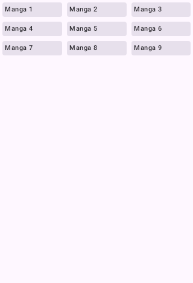
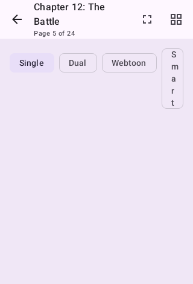

# Otaku Reader

<div align="center">
  

  <p><em>A modern, manga-only Android reader — no AI, no cloud, no ads, no tracking.</em></p>

  [](https://github.com/Heartless-Veteran/Otaku-Reader/actions/workflows/build.yml)
  [](https://github.com/Heartless-Veteran/Otaku-Reader/actions/workflows/ci.yml)
  [](https://kotlinlang.org/)
  [](https://developer.android.com/)
  [](LICENSE)
  [](https://developer.android.com/jetpack/compose)
  [](https://github.com/Heartless-Veteran/Otaku-Reader/stargazers)
  [](https://heartless-veteran.github.io/Otaku-Reader/)

  **[📖 Website & Guides](https://heartless-veteran.github.io/Otaku-Reader/)** · **[⬇ Download](https://heartless-veteran.github.io/Otaku-Reader/download.html)**

</div>

---

> **Privacy First:** All data stays on your device. No accounts, no tracking, no cloud, no AI. Ever.
> <br>**Local-first, never lock-in.**

---

## 📋 Contents

- [Quick Start](#-quick-start)
- [Download](#-download)
- [What Makes It Different](#-what-makes-it-different)
- [Features](#-features)
- [Reader Comparison](#-reader-comparison)
- [Privacy & Security](#-privacy--security)
- [Screenshots](#-screenshots)
- [Roadmap](#-roadmap)
- [Tech Stack](#-tech-stack)
- [Architecture](#-architecture)
- [Contributing](#-contributing)

---

## ⚡ Quick Start

```bash
# Clone & build in 30 seconds
git clone https://github.com/Heartless-Veteran/Otaku-Reader.git
cd Otaku-Reader
./gradlew assembleDebug
```

Or grab a [release APK](https://github.com/Heartless-Veteran/Otaku-Reader/releases) — no accounts, no setup. New here? The [website](https://heartless-veteran.github.io/Otaku-Reader/) has install and setup guides.

---

## 📥 Download

| Build | Description | Status |
|-------|-------------|--------|
| **Otaku Reader** | Single flat build — open-source core, no proprietary SDKs, no AI. | 🔨 Build from source or watch for releases |

**Minimum Requirements:** Android 8.0 (API 26) · target APK < 10 MB

---

## ✨ What Makes It Different

Every Tachiyomi fork is a maintenance burden with half-finished features. Otaku Reader is intentionally **manga-only**, **Compose-native**, and **built to actually work** on day one.

### Core Philosophy
- **One app, one job:** Read manga. Nothing else.
- **Zero accounts required:** No Google, no Firebase, no sign-up. Ever.
- **No AI in core:** No ML models, no data mining. Just manga.
- **Switch in 60 seconds:** Restore from Mihon/Komikku/Tachiyomi backup → reading immediately.

### Built From Scratch
This is not a fork. Otaku Reader was written from the ground up — the core app, UI, and architecture are original work. The extension system enables compatibility with existing source repositories (Keiyoushi, Komikku). Everything else is homegrown.

---

## 🚀 Features

### Currently Implemented

<details open>
<summary>📚 Library & Organization</summary>

- 📚 **Smart library** — Grid/list views, categories, sorting, filtering, unread badges
- 📂 **Categories** — Manual category creation and manga assignment
- 🔖 **Saved library views** — Save named filter+sort combinations, re-apply with one tap
- 🔍 **Library search** — FTS4 full-text search across title, author, artist
- 🔍 **Global search** — Search across all installed sources simultaneously
- 🧹 **Library maintenance center** — Cover refresh, metadata refresh, download reindex, orphaned-file cleanup
- 🖼️ **Custom cover art** — Replace any cover with your own image from the Details menu
- ✏️ **Edit manga info** — Override title, author, artist, description, genres, and status; edits survive updates and are included in backups
- 🤖 **Dynamic categories** — Rule-based categories that populate themselves
- 🔀 **Duplicate merge** — Detect and merge duplicate entries, with cross-source detection and alternative-source linking
- ✅ **Bulk action confirmations** — Destructive selection actions confirm before running
- 📱 **Widget navigation** — Home screen widgets for continue reading, now reading, and recent updates with deep-link navigation
- 📂 **QR library sharing** — Share library via text/URL (local, no server)

</details>

<details open>
<summary>📖 Reading Experience</summary>

- 📖 **All reader modes** — Paged, webtoon, continuous scroll, dual-page, smart panels
- 🎛️ **Per-manga reader overrides** — Direction, mode, color filter, and tint remembered per series
- 🎨 **Color filters & e-ink mode** — Night tints, custom tint color, B&W rendering with page-turn flash
- 💾 **Reader presets** — Save full setting bundles (13 captured settings) and switch with one tap
- 🔖 **Page bookmarks** — Bookmark any page within a chapter, with optional notes
- 💬 **Reader comments** — Private timestamped comments per chapter or per series, plus the chapter note, in an in-reader panel with links to tracker discussion pages
- 🔍 **OCR text search** — Find dialogue inside page images
- 📱 **Adaptive layouts** — Optimized for phones, foldables, tablets, and DeX

</details>

<details open>
<summary>⬇️ Downloads & Offline</summary>

- ⬇️ **Download manager** — Queue, progress, offline reading
- 📦 **CBZ export** — Archive downloaded chapters for backup or transfer
- 🔒 **CBZ encryption** — Optional AES-256-GCM password protection for downloaded archives
- 🗂️ **Auto-download by category** — Per-category include/exclude control over auto-download
- 🧮 **Storage analytics** — Per-source/per-manga usage with in-place delete actions
- 📁 **Local source import** — CBZ/CBR/folder browsing without extensions, optional hidden-folder scanning
- 🔔 **Smart notification batching** — Grouped chapter update alerts (backend worker active)

</details>

<details open>
<summary>🔌 Discovery & Sources</summary>

- 🔌 **Extension system** — Tachiyomi/Komikku-compatible sources (Keiyoushi, Komikku repos)
- 🗃️ **Multi-repository management** — Add any number of extension repos; failures are isolated per repo with clear error messages
- 🚫 **Extension blocklist** — Known-bad extensions filtered automatically (daily refresh)
- 🛡️ **Extension trust & provenance** — Signer-hash continuity checks warn if an extension's signing certificate changes after install
- 📄 **Extension detail screen** — Version, signer hash, repo link, capabilities, source list, trust/untrust action
- 🩺 **Source health diagnostics** — Per-source failure tracking with warning badges in Browse
- 📌 **Source categories & pinning** — Pin favorite sources, group the rest under custom labels
- 🔎 **Saved source searches** — Save named queries as chips, re-run with one tap
- ☁️ **WebView session bridge** — Cloudflare challenge handling with cookie sharing to extension requests
- 🌐 **OPDS client** — Browse Komga, Kavita, Calibre-Web libraries
- 📰 **Feed** — New chapter updates from your sources in one place
- 🔗 **Deep links** — Open manga and chapters directly from external links

</details>

<details open>
<summary>📊 Tracking & Stats</summary>

- 📊 **Reading streaks** — Consecutive-day counter with 30-day heatmap
- 🏆 **Reading goals** — Daily/weekly chapter targets with progress
- 📈 **Statistics dashboard** — Time read, chapters completed, genre breakdown
- 🔗 **Tracker sync** — AniList, MyAnimeList (MAL), Kitsu, MangaUpdates, Shikimori (opt-in, local-only API keys)
- 🎮 **Discord Rich Presence** — Share what you're reading with Discord status integration

</details>

<details open>
<summary>💾 Backup & Migration</summary>

- 💾 **Local backup/restore** — Human-readable JSON in ZIP, everything stays on-device; backup v4 covers every customization (custom titles/covers, per-manga reader settings, notes, category schedules)
- ☁️ **WebDAV cloud backup** — Scheduled uploads to Nextcloud, ownCloud, or any WebDAV server (opt-in, your server)
- 📦 **Tachiyomi/Mihon/Komikku import** — Restore an existing backup and keep reading in minutes
- 🔄 **Auto-backup worker** — Periodic automatic backups run in background
- 🔄 **Source-to-source migration** — Move manga between sources without losing progress

</details>

### Beta Status

**All 35 beta-parity issues (#926–#958) have shipped**, along with the extension trust/health audit, the QoL batch, and a full-app pre-release bug sweep. See [CHANGELOG.md](CHANGELOG.md) for the complete list and the [website](https://heartless-veteran.github.io/Otaku-Reader/) for user guides.

---

## 📖 Reader Comparison

| Feature | Otaku Reader | Typical Fork |
|---------|-------------|--------------|
| Smooth webtoon scroll | ✅ Pre-rendered, no jank | ❌ Stutters on long chapters |
| Page-stitching | ✅ Smart chunk merge | ❌ Manual zoom required |
| Per-manga zoom memory | ✅ Remembered per title | ❌ Global only |
| Volume-key paging | ✅ Debounced, reliable | ⚠️ Spotty |
| Battery-aware brightness | ✅ Auto curve | ❌ Manual slider only |
| Predictive back (Android 14+) | ✅ Fullscreen gesture | ❌ System default |
| Extension system | ✅ 2000+ Tachiyomi sources | ✅ Same sources |
| OPDS support | ✅ Client + server mode | ❌ Not available |
| Discord Rich Presence | ✅ Live reading status | ❌ Not available |
| Home screen widgets | ✅ Continue reading + recent updates | ❌ Not available |
| Deep link support | ✅ Open manga from external URLs | ❌ Not available |
| Tracker sync | ✅ 5 trackers, auto-sync | ✅ Usually 3-5 |
| Library search | ✅ FTS4 full-text | ✅ Yes |
| Biometric lock | ✅ With time/day scheduling | ✅ Basic only |
| Smart download rules | ✅ Threshold + category rules | ⚠️ Basic only |
| Backup import | ✅ Tachiyomi/Mihon/Komikku | ✅ Yes |
| Extension trust provenance | ✅ Signer-hash continuity warnings | ❌ Not available |
| CBZ encryption | ✅ AES-256-GCM at rest | ❌ Not available |
| Source health diagnostics | ✅ Per-source failure tracking | ❌ Not available |

**Reading Modes:** Paged · Webtoon · Continuous Scroll · Dual-Page · Smart Panels

**Navigation:** Gallery thumbnails · 3×3 tap zones · Pinch zoom · Hardware key support · Auto-scroll

**Accessibility:** TalkBack-readable · Dyslexia-friendly font · High-contrast theme · Color-blind safe palettes

---

## 🔐 Privacy & Security

- ✅ **No data collection** — Everything stays local
- ✅ **No accounts required** — Use without any registration
- ✅ **No analytics or tracking** — Reading habits are yours alone
- ✅ **Encrypted preferences** — Secure local storage for tracker API keys
- ✅ **HTTPS-only extensions** — Enforced secure source downloads
- ✅ **Sandboxed extensions** — Isolated classloading for untrusted sources

**Data stored locally:** library, downloaded chapters, preferences, extension sources, backup files, page bookmarks, reading history.

**Optional internet use:** manga source browsing · tracker sync (opt-in) · OPDS server (opt-in) · update check

---

## 📸 Screenshots

<div align="center">

| Library | Reader |
|---------|--------|
|  |  |

<em>UI captures from the Roborazzi screenshot test suite — device screenshots coming with the beta release.</em>

</div>

---

## 🗺️ Roadmap

### ✅ Phase 0: Clean Slate
- [x] Remove AI module from core repo (moved to separate repo, on hold)
- [x] Remove cloud sync and self-hosted server modules → [Otaku-Reader-Sync](https://github.com/Heartless-Veteran/Otaku-Reader-Sync)
- [x] Flat single-product build (no `full`/`foss` flavors)

### ✅ Phase 1: Core App Wiring
- [x] Hilt DI audit — no cycles, all bindings present
- [x] Single Compose navigation graph with type-safe routes
- [x] Material3 theme (light / dark / dynamic)
- [x] DataStore settings backbone
- [x] Base MVI pattern for every screen

### ✅ Phase 2: Manga Core Loop
- [x] Room database: Manga, Chapter, History, Category, Feed, OPDS
- [x] Source API (Komikku/Keiyoushi compatible)
- [x] Extension system: install, verify, configure index
- [x] Library + Browse screens (Compose-native)
- [x] Manga details, download, bookmark
- [x] Reader with all modes + accessibility
- [x] Downloader (CBZ, notifications, WorkManager)
- [x] Local source import (CBZ/CBR/folders)
- [x] History, updates, search, settings
- [x] Smart download rules (auto-queue at reading threshold)

### ✅ Phase 3: Trackers, Backup, Polish
- [x] Tracker integration (AniList/MAL/Kitsu/MangaUpdates/Shikimori)
- [x] Backup/restore (human-readable JSON in ZIP)
- [x] Source-to-source migration
- [x] Update check via GitHub Releases
- [x] OPDS client + server
- [x] Reading streaks + stats dashboard
- [x] Completed/Dropped series sections
- [x] Per-manga dynamic theme
- [x] QR library sharing
- [x] Tachiyomi/Mihon/Komikku import
- [x] Page bookmarks
- [x] Read time estimation
- [x] Chapter notes
- [x] Reading list collections
- [x] Statistics sharing
- [x] Auto-backup scheduling
- [x] Smart notification batching
- [x] Search history
- [x] Home screen widgets
- [x] Deep link handling
- [x] Discord Rich Presence

### ✅ Phase 4: Alpha Release
- [x] Critical Compose UI tests (library, reader) — Robolectric-based
- [x] Green CI: ktlint, unit tests, signed APK on every `v*` tag
- [x] Keystore signing via GitHub Secrets — release builds are installable
- [x] Branch protection enforced
- [x] Gradle convention plugins modernized + SDK levels centralized in version catalog
- [x] All alpha readiness gates green

### ✅ Phase 5: Beta Feature Parity
The 35-issue beta parity backlog (#926–#958) plus the QoL and extension-system audits have been delivered. Highlights:
- [x] Library search (FTS4), saved library views, library maintenance center
- [x] Reader overlays, presets (13 captured settings), per-mode volume keys
- [x] Biometric lock with time/day scheduling
- [x] Backup checklist + restore preflight, backup encryption
- [x] Smart download rules, auto-download by category, CBZ encryption
- [x] Widget configuration studio, nav tab drag-reorder
- [x] Tracking health page, data usage budget + per-source drill-down
- [x] Extension Detail Screen 2.0, signer-hash provenance, source health diagnostics
- [x] Source categories & pinning, saved source searches, WebView session bridge
- [x] Cross-source duplicate detection, update history & diagnostics

See [CHANGELOG.md](CHANGELOG.md) for the complete list.

### ✅ Phase 6: Beta Hardening (June 2026)
- [x] Extension blocklist (#1018), repository provenance tracking (#1019), cross-source merge workflow (#1053)
- [x] E-Hentai favorites sync with full pagination (#1090, #1092)
- [x] Custom cover art + onboarding appearance step (#1093)
- [x] Extension repository loading — five root-cause fixes (#1094)
- [x] Full-app bug sweep: backup v4 customization coverage, reader pager crash guards, Keystore corruption recovery, sync retry caps, WebView scheme hardening (#1097)
- [x] Reader comments with chapter/book scopes (#1098)
- [x] Project website on GitHub Pages (#1099) — https://heartless-veteran.github.io/Otaku-Reader/

### Future Differentiators
- [ ] Curated default extension index (opt-out)
- [ ] Per-source rate limiting with visible queue
- [ ] Optional ActivityPub federation for read-status
- [ ] Double-page spread auto-detection

---

## 🛠️ Tech Stack

| Layer | Technology |
|-------|------------|
| Language | Kotlin 2.3.21 |
| UI | Jetpack Compose 100% — no XML layouts |
| Architecture | Clean Architecture + MVI |
| Dependency Injection | Hilt 2.59.2 |
| Database | Room 2.8.4 + KSP |
| Preferences | DataStore |
| Networking | OkHttp 4.12.0 + Coil 3.1.0 |
| Background Work | WorkManager 2.11.2 |
| Build | Gradle 8.11 + convention plugins + version catalogs + signed release APKs |

---

## 🏗️ Architecture

Otaku Reader follows **Clean Architecture** with three horizontal layers and feature-based vertical modules:

```
app/                    — Application module (DI wiring, manifest, widgets, deep links)
├── core/
│   ├── common/         — Shared utilities, Result type, ReadTimeEstimator
│   ├── ui/             — Compose design system, theme, dynamic color extraction
│   ├── navigation/     — Type-safe navigation graph
│   ├── preferences/    — DataStore wrappers (General, Reader, Download, Goals, OAuth)
│   ├── database/       — Room entities, DAOs, migrations (v21)
│   ├── network/        — OkHttp interceptors, certificate pinning, network DI
│   ├── extension/      — ExtensionLoader, TrustedSignatureStore
│   ├── tachiyomi-compat/ — Bridges Tachiyomi APKs to source-api interfaces
│   └── discord/        — Discord Rich Presence service
├── domain/             — Pure Kotlin: use cases, repository interfaces, models. Zero Android deps.
├── data/               — Repository implementations, workers, network
│   ├── backup/         — Backup/restore logic (human-readable JSON in ZIP)
│   ├── download/       — Download manager, CBZ export
│   ├── tracking/       — Tracker sync (AniList, MAL, Kitsu, MangaUpdates, Shikimori)
│   └── opds/           — OPDS client/server
├── source-api/         — Extension SDK contract (Source, HttpSource, SManga, etc.). No Android deps.
└── feature/
    ├── library/        — Library grid, categories, filters, completed/dropped
    ├── browse/         — Sources, extensions, global search, search history
    ├── details/        — Manga info, chapters, read time estimates
    ├── reader/         — All reading modes + page bookmarks + smart download trigger
    ├── history/        — Reading history
    ├── updates/        — New chapter notifications + smart batching
    ├── tracking/       — Tracker settings + sync
    ├── settings/       — App preferences
    ├── migration/      — Source-to-source + Tachiyomi/Mihon/Komikku import
    ├── onboarding/     — First-launch setup wizard
    ├── about/          — Credits, licenses, updates
    ├── statistics/     — Reading stats + streaks + heatmap + shareable cards
    ├── feed/           — New chapter updates feed from sources
    ├── opds/           — OPDS client/server mode
    └── more/           — QR library sharing, additional tools
```

### Module Dependency Rules

- **`domain`** — Pure Kotlin, zero dependencies. Contains use cases, repository interfaces, and models.
- **`data`** — Depends on `domain` + `core/*`. Contains repository implementations, Room DAOs, WorkManager workers.
- **`feature/*`** — Depends on `domain` + `core/*`. Each feature is self-contained. **No feature module may depend on another feature module.**

---

## 🤝 Contributing

We welcome contributions! Please see [CONTRIBUTING.md](CONTRIBUTING.md) for guidelines.

### Quick Start

```bash
# Clone
git clone https://github.com/Heartless-Veteran/Otaku-Reader.git
cd Otaku-Reader

# Build debug APK
./gradlew assembleDebug

# Run checks
./gradlew detekt
./gradlew testDebugUnitTest
```

See [docs/contributing/ci.md](docs/contributing/ci.md) for the full CI command reference.

---

## 🔗 See Also

- **[Otaku-Reader-Sync](https://github.com/Heartless-Veteran/Otaku-Reader-Sync)** — Optional cloud sync server for cross-device library sync.

---

<div align="center">

```
Copyright 2025 Manny Carter

Licensed under the Apache License, Version 2.0 (the "License");
you may not use this file except in compliance with the License.
You may obtain a copy of the License at

    http://www.apache.org/licenses/LICENSE-2.0

Unless required by applicable law or agreed to in writing, software
distributed under the License is distributed on an "AS IS" BASIS,
WITHOUT WARRANTIES OR CONDITIONS OF ANY KIND, either express or implied.
See the License for the specific language governing permissions and
limitations under the License.
```

</div>

---

## 🙏 Acknowledgments

- [Komikku](https://github.com/komikku-app/komikku) — Architecture & feature baseline
- [Keiyoushi](https://github.com/keiyoushi) — Extension repository
- Tachiyomi community — Extension ecosystem foundation
